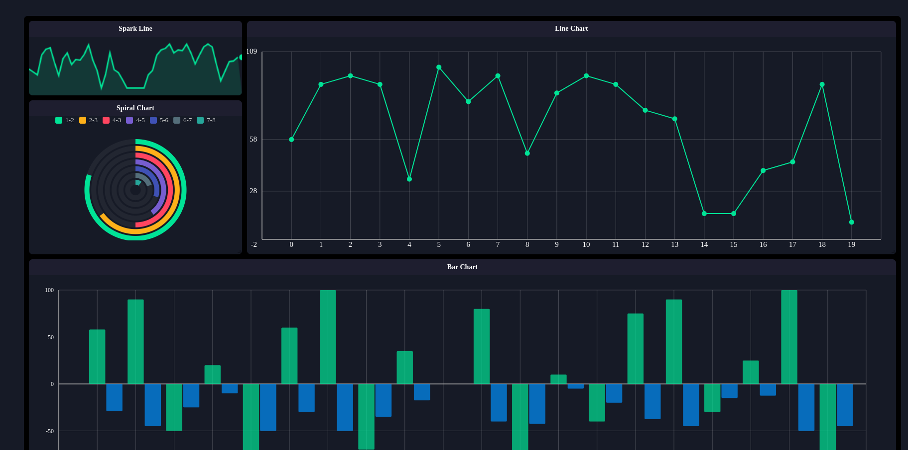
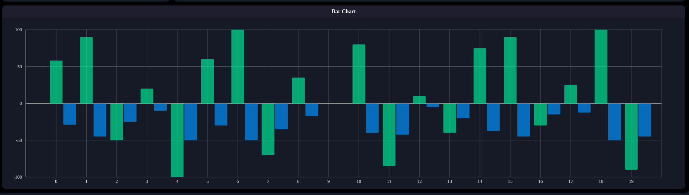
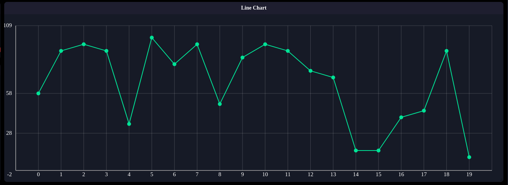

# 📈 Responsive SVG Line Chart with Tooltip (Vue 3)

Interaktiv va moslashuvchan (responsive) SVG Line Chart Vue 3 yordamida yozilgan. Bu komponent real vaqt ma'lumotlarini yoki statistikani vizual ko‘rsatish uchun qulay bo‘lib, ustiga bosilganda tooltip (ko‘rsatkich) ko‘rinadi.

 <!-- Rasmingizni loyihaga qo‘shing -->
 <!-- Rasmingizni loyihaga qo‘shing -->
 <!-- Rasmingizni loyihaga qo‘shing -->

---

## ✨ Asosiy imkoniyatlari

- 📊 Chiroyli SVG asosida chizilgan Line Chart
- 🖱 Tooltip (ko‘rsatkich) hover paytida ko‘rinadi
- 📐 Responsive o‘lcham — ekran hajmiga moslashadi
- 🧮 Grid liniyalar va etiketkalar
- ⚡ Kompozitsiya API yordamida yozilgan (Vue 3)

---

## 🛠 Texnologiyalar

- [Vue 3](https://vuejs.org/)
- Composition API
- SVG
- CSS (scoped)

---

## 🚀 O‘rnatish va ishga tushirish

```bash
# Klonlash
git clone https://github.com/XayrullaOdilivich/Diagram.git
cd your-repo-name

# Paketlarni o‘rnatish
npm install

# Lokal serverni ishga tushirish
npm run dev
